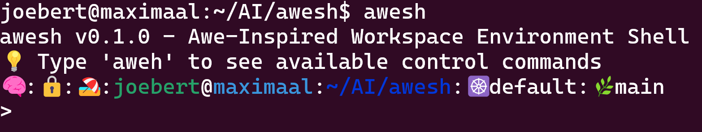

# awesh - AI-Aware Interactive Shell



**awesh** is an AI-aware interactive shell that provides intelligent assistance while preserving all the power and familiarity of traditional bash operations.

## ⚡ Quickstart - Get awesh Running Fast

### 🚀 Installation
```bash
# Clone and install awesh
git clone https://github.com/joebertj/awesh.git
cd awesh

# Build and deploy
python3 simple_deploy.py full

# Or step by step:
python3 simple_deploy.py build          # Build awesh
python3 simple_deploy.py deploy         # Deploy to ~/.local/bin
python3 simple_deploy.py test           # Run test suite
```

### 🔑 Configure Your AI
```bash
# OpenAI (recommended)
python3 switch_model.py gpt4            # Use GPT-4-turbo
python3 switch_model.py status          # Check current config

# Or OpenRouter (free)
python3 switch_model.py mistral         # Use Mistral (free)

# Edit ~/.aweshrc for custom settings
vi ~/.aweshrc
```

### 🎯 Start Using awesh
```bash
# Launch awesh (from anywhere after deployment)
~/.local/bin/awesh

# Try these examples:
> create a script to check all open ports
> find all python files modified today
> what does netstat do?
> check disk space
> update port to 8080 in config.py
```

### 🛠️ Development Workflow
```bash
# Fast development cycle
python3 simple_deploy.py full           # Kill, build, deploy, commit, push
python3 simple_deploy.py build          # Build only
python3 simple_deploy.py deploy         # Deploy only
python3 simple_deploy.py test           # Run tests
python3 simple_deploy.py kill           # Kill processes
```

### 🔧 Configuration
```bash
# Edit ~/.aweshrc for persistent settings
VERBOSE=1                    # 0=silent, 1=info, 2=debug
AI_PROVIDER=openai          # openai or openrouter
MODEL=gpt-5                 # AI model to use
```

### 🎮 Control Commands
```bash
# Inside awesh
aweh                        # Show help and all available commands
awes                        # Show verbose status (API provider, model, debug state)
awea                        # Show current AI provider and model
awea openai                 # Switch to OpenAI
awea openrouter             # Switch to OpenRouter
awem                        # Show current model
awem gpt-4                  # Set model to GPT-4
awem gpt-3.5-turbo          # Set model to GPT-3.5 Turbo
awem claude-3               # Set model to Claude 3
awev                        # Show verbose level
awev 0/1/2                  # Set verbose level
awev on/off                 # Enable/disable verbose
```

**That's it!** You now have AI-powered shell assistance with security middleware, intelligent command routing, and full bash compatibility.

## 📖 Related Reading

**[AIOps: Artificial Intelligence for IT Operations](https://www.amazon.com/dp/B0FNKKXFPQ)** - A comprehensive guide to the AI revolution in IT operations, documenting real-world transformations and practical implementation strategies. Written by the creator of this toolkit, it provides the theoretical foundation and strategic insights behind these tools.

## 🐚 awesh - AIWES (Awe-Inspired Workspace Environment Shell)
*"AI by default, Bash when I mean Bash"*

**💎 Naming Inspiration:**
awesh draws its name from my eldest daughter, **Awit Perl** - where "Awit" means "Psalm" in Filipino, representing both "Awe" and "Wit," while "Perl" means "Pearl" (still more OG than the Python we have today). This shell embodies the same wonder and wisdom that inspired its creation.

An intelligent shell that seamlessly blends natural language AI interaction with traditional command-line operations. **Built by Ops, for Ops** - designed for systems administrators, DevOps engineers, and infrastructure professionals who live in the terminal.

**💡 The "Free Cursor" Concept:**
awesh represents what we really want from AI-assisted development: the AI assistance without the IDE bloat. It's a "free cursor" that's purely shell-based - giving you AI-powered development in your terminal without the overhead of editors or opinionated tool prompts.

**🌍 Democratizing AI-Powered Development:**
awesh brings the **Cursor/Claude Code experience to every shell**, democratizing AI-assisted development by making it a **shell primitive**, not an editor feature:

- **🚀 Universal Access**: Any Linux/Unix system becomes AI-powered - no editor lock-in
- **⚡ Shell-Native AI**: Natural language commands get AI interpretation and auto-execution  
- **🔄 Intent Recognition**: "read md files" → AI understands → `ls *.md` → Shows results seamlessly
- **🛠️ Tool Integration**: Works with vi, nano, grep, git - your existing workflow enhanced
- **🔓 Open Ecosystem**: Not dependent on proprietary platforms or specific editors

Instead of being locked into AI editors, **every shell becomes an AI-powered operations environment**. This democratizes access to AI-assisted infrastructure management for anyone with a terminal.

**🔧 The Ops-First Philosophy:**
awesh embraces the **minimalistic yet powerful** approach that operations professionals know and love:

- **🖥️ Shell + vi Workflow**: Designed for those who live in terminals and edit with vi/vim
- **⚡ No IDE Bloat**: Pure shell experience - familiar, fast, and efficient
- **🛠️ Infrastructure-Focused**: Built for system administration, not application development  
- **📊 Ops Mindset**: Troubleshooting, monitoring, deployment - operations tasks first
- **🔍 Minimal Learning Curve**: If you know bash and vi, you know awesh

**For the shell/vi professional** who wants AI assistance without abandoning the minimalistic, powerful tools that make operations efficient.

**🎯 Ideal Test Users:**
A 23-year terminal veteran is the perfect test user for writing an AI-enhanced terminal - not developers who spent time in advanced IDEs pampered by so much GUI tooling. Experienced terminal users understand the real workflow, know what's actually needed, and can identify when AI assistance genuinely enhances rather than complicates the shell experience.

**🌟 Core Philosophy:**
- **Zero-Friction AI**: No special syntax - just type naturally
- **Intelligent Routing**: Automatically detects AI vs Bash intent
- **Context-Aware**: Remembers your environment and command history
- **Safety First**: AI suggestions with human control
- **Gradual Adoption**: Works alongside your existing workflow

**🚀 Key Features:**
- **Smart Command Routing**: Detects shell syntax, commands, and natural language automatically
- **OpenAI Integration**: Powered by GPT-4/GPT-5 with configurable models
- **System Prompt Support**: Customizable AI behavior for your operations context  
- **Streaming Responses**: Real-time AI output with conversation continuity
- **Environment Variable Support**: Easy configuration via `~/.aweshrc`
- **MCP Integration**: Secure tool execution through Model Context Protocol
- **Full Bash Compatibility**: All your existing commands work exactly as before

**💡 Example Usage:**
```bash
awesh> ls -la                              # → Sandbox validation → Direct execution
awesh> what files are here?                # → Sandbox validation → AI query via middleware
awesh> find . -name "*.py"                 # → Sandbox validation → Direct execution  
awesh> explain this error                  # → Sandbox validation → AI query via middleware
awesh> cat file.txt | grep error           # → Sandbox validation → Direct execution
awesh> summarize this directory structure  # → Sandbox validation → AI query via middleware
awesh> why did the build fail?             # → Sandbox validation → AI query via middleware
awesh> awem gpt-4                          # → Built-in command (set model)
awesh> awev 1                              # → Built-in command (enable verbose)
```

**"AI by default, Bash when I mean Bash."**

**🔧 Installation:**
```bash
# Use deployment MCP for clean installation with virtual environment
python3 deployment_mcp.py clean_install

# Configure your OpenAI API key
export OPENAI_API_KEY=your_api_key_here
awesh
```

**🐍 Virtual Environment Enforcement:**
AIOps automatically uses a Python virtual environment for all operations, ensuring:
- **Dependency isolation** from system Python packages
- **Consistent environments** across different systems  
- **Clean deployments** with reproducible setups
- **No conflicts** with system-installed packages

The deployment script automatically creates and manages the virtual environment, installing all dependencies in isolation.

**🔧 Configuration:**
Set these environment variables in your shell:

```bash
# AI Provider Configuration
export AI_PROVIDER=openai                    # openai or openrouter
export OPENAI_MODEL=gpt-5                   # Model to use
export OPENAI_API_KEY=sk-proj-abc123...xyz  # Your OpenAI API key (truncated)

# OpenRouter Configuration (if using openrouter)
export OPENROUTER_API_KEY=sk-or-v1-abc...xyz # Your OpenRouter API key (truncated)
export OPENROUTER_MODEL=anthropic/claude-3-sonnet

# Display Options  
export VERBOSE=1              # 0=silent, 1=info, 2=debug (default: 1)

# File Agent Options
export FILE_AGENT_ENABLED=1           # 1=enabled, 0=disabled (default: 1)
# Note: AI prompt enhancement is always enabled for built-in agents
export FILE_AGENT_MAX_FILE_SIZE=50000 # Max size per file in bytes (default: 50000)
export FILE_AGENT_MAX_TOTAL_CONTENT=10000 # Max total content to inject (default: 10000)
export FILE_AGENT_MAX_FILES=5         # Max number of files to include (default: 5)
```

**Example configuration:**
```bash
export AI_PROVIDER=openai
export OPENAI_MODEL=gpt-5
export OPENAI_API_KEY=sk-proj-JrUoBu9D4iCb...T3BlbkFJMEjXf8l0w9SPKE-Rw
export VERBOSE=1
```

**⚠️ Testing Status:**
> **Currently optimized for OpenAI GPT-5**: awesh is actively tested and developed using OpenAI's GPT-5 model. While OpenRouter and other AI providers are supported, they may exhibit unexpected behavior or suboptimal performance. We recommend using OpenAI with GPT-5 for the most reliable experience while we continue testing and improving compatibility with other providers.

**🎛️ Control Commands:**
```bash
# Help & Status
aweh            # Show all available awesh control commands
awes            # Show verbose status (API provider, model, debug state)
awea            # Show current AI provider and model

# Model Management
awem            # Show current model
awem gpt-4      # Set model to GPT-4
awem gpt-3.5-turbo # Set model to GPT-3.5 Turbo
awem claude-3   # Set model to Claude 3

# Verbose Debug Control
awev            # Show verbose level status
awev 0          # Set verbose level 0 (silent)
awev 1          # Set verbose level 1 (info)
awev 2          # Set verbose level 2 (debug)
awev on         # Enable verbose logging (level 1)
awev off        # Disable verbose logging (level 0)

# AI Provider Switching
awea openai     # Switch to OpenAI (GPT models)
awea openrouter # Switch to OpenRouter (multiple providers)
```

*Control commands use the `awe` prefix to avoid conflicts with bash builtins and create a clean namespace for awesh operations.*

## 📄 License

This project is open source and available under the Apache License 2.0.

---

*awesh: Where artificial intelligence meets shell operations. Making the complex simple, the manual automatic, and bringing AI assistance to every terminal.*


## 🏗️ Architecture

<details><summary>Click to expand</summary>


# awesh Architecture Diagram

## System Overview

```
┌─────────────────────────────────────────────────────────────────────────────────┐
│                                awesh System Architecture                        │
│                          "AI by default, Bash when I mean Bash"                │
│                             4-Component Architecture                           │
└─────────────────────────────────────────────────────────────────────────────────┘

┌─────────────────┐    ┌─────────────────┐    ┌─────────────────┐    ┌─────────────────┐
│   User Input    │    │  C Frontend     │    │ Security Agent  │    │ Python Backend  │
│                 │    │   (awesh.c)     │    │ (awesh_sec)     │    │ (awesh_backend) │
│ • Natural Lang  │───▶│                 │───▶│                 │───▶│                 │
│ • Shell Commands│    │ • Readline UI   │    │ • Middleware    │    │ • AI Processing │
│ • Mixed Input   │    │ • Command Route │    │ • Security Gate │    │ • MCP Tools     │
└─────────────────┘    │ • Socket Client │    │ • RAG Analysis  │    │ • File Agent    │
                       │ • PTY Support   │    │ • Socket Server │    │ • Socket Server │
                       └─────────────────┘    └─────────────────┘    └─────────────────┘
                                │                        │                        │
                                │                        │                        │
                                ▼                        ▼                        ▼
┌─────────────────┐    ┌─────────────────┐    ┌─────────────────┐    ┌─────────────────┐
│ Bash Sandbox    │    │  Unix Sockets   │    │   AI Provider   │    │  Config Files   │
│ (awesh_sandbox) │    │                 │    │                 │    │                 │
│                 │    │ • ~/.awesh_sandbox.sock│ • OpenAI API    │    │ • ~/.aweshrc    │
│ • Bash Validation│    │ • ~/.awesh_security_agent.sock│ • OpenRouter    │    │ • ~/.awesh_config.ini│
│ • Syntax Check  │    │ • ~/.awesh.sock │    │ • GPT-4/5       │    │ • Verbose Control│
│ • Return Codes  │    │ • Status Sync   │    │ • Streaming     │    │ • AI Settings   │
│ • No Execution  │    │ • Command Flow  │    │ • Tool Calling  │    │ • Security Rules│
└─────────────────┘    └─────────────────┘    └─────────────────┘    └─────────────────┘
```

## Component Details

### 1. C Frontend (awesh.c)
```
┌─────────────────────────────────────────────────────────────────┐
│                        C Frontend (awesh.c)                    │
├─────────────────────────────────────────────────────────────────┤
│ • Interactive Shell with Readline Support                      │
│ • Smart Command Routing (Sandbox → AI → Direct)                │
│ • Built-in Commands: cd, pwd, exit, quit                       │
│ • Socket Communication with Backend & Sandbox                  │
│ • Security Agent Integration                                   │
│ • Dynamic Prompt Generation (0ms)                              │
│ • Process Health Monitoring & Auto-restart                     │
│ • PTY Support for Interactive Commands                         │
│ • Independent Operation (works as regular bash)                │
└─────────────────────────────────────────────────────────────────┘

Key Functions:
├── Command Routing Logic
│   ├── is_awesh_command() - Control commands (aweh, awes, awev, awea)
│   ├── is_builtin() - Built-in shell commands
│   ├── test_command_in_sandbox() - Sandbox command testing
│   ├── is_interactive_command() - Interactive command detection
│   └── execute_command_securely() - Main command execution
│
├── Communication
│   ├── send_to_backend() - Backend socket communication
│   ├── send_to_sandbox() - Sandbox socket communication
│   ├── send_to_security_agent() - Security agent communication
│   └── init_frontend_socket() - Frontend socket server
│
├── Process Management
│   ├── restart_backend() - Backend process restart
│   ├── restart_security_agent() - Security agent restart
│   ├── restart_sandbox() - Sandbox process restart
│   └── attempt_child_restart() - Auto-restart failed processes
│
└── Security Integration
    ├── get_security_agent_status() - Threat status
    ├── get_health_status_emojis() - Process health (🧠:🔒:🏖️)
    └── Config file reading (~/.aweshrc)
```

### 2. Python Backend (awesh_backend)
```
┌─────────────────────────────────────────────────────────────────┐
│                    Python Backend (awesh_backend)              │
├─────────────────────────────────────────────────────────────────┤
│ • Socket Server (Unix Domain Sockets)                          │
│ • AI Client Integration (OpenAI/OpenRouter)                    │
│ • MCP (Model Context Protocol) Tool Execution                  │
│ • File Agent for File Operations                               │
│ • RAG (Retrieval Augmented Generation) System                  │
│ • Security Integration                                         │
└─────────────────────────────────────────────────────────────────┘

Components:
├── AweshSocketBackend (server.py)
│   ├── Socket Server (~/.awesh.sock)
│   ├── Command Processing
│   ├── AI Client Management
│   └── File Agent Integration
│
├── AweshAIClient (ai_client.py)
│   ├── OpenAI/OpenRouter Integration
│   ├── Streaming Responses
│   ├── System Prompt Management
│   └── Tool Function Calling
│
└── FileAgent (file_agent.py)
    ├── File Reading Operations
    ├── Content Filtering
    └── AI-Enhanced File Analysis
```

### 3. Security Agent (awesh_sec)
```
┌─────────────────────────────────────────────────────────────────┐
│                    Security Agent (awesh_sec)                  │
├─────────────────────────────────────────────────────────────────┤
│ • Process Monitoring (Every 5 seconds)                         │
│ • AI-Powered Threat Detection (Every 5 minutes)                │
│ • Pattern-Based Security Filtering                             │
│ • Config File Reading (~/.aweshrc)                             │
│ • RAG Data Collection & Analysis                               │
│ • Isolated Operation (no socket server)                        │
└─────────────────────────────────────────────────────────────────┘

Security Features:
├── Process Scanning
│   ├── Backend API calls for process data
│   ├── RAG Data Collection (Every 5s)
│   └── AI Analysis (Every 5min)
│
├── Pattern Detection
│   ├── Dangerous Commands (rm -rf /, dd, mkfs, etc.)
│   ├── Sensitive Data (passwords, keys, tokens)
│   └── Regex-based Filtering
│
└── Communication
    ├── Backend Socket Connection (security analysis only)
    ├── Config File Reading (verbose control)
    └── Threat Alert Propagation
```

### 4. Bash Sandbox (awesh_sandbox)
```
┌─────────────────────────────────────────────────────────────────┐
│                    Bash Sandbox (awesh_sandbox)                │
├─────────────────────────────────────────────────────────────────┤
│ • PTY-based Bash Environment                                   │
│ • Command Testing & Execution                                  │
│ • Interactive Command Detection                                │
│ • Socket Communication with Frontend                           │
│ • Automatic Cleanup on Interactive Commands                    │
└─────────────────────────────────────────────────────────────────┘

Sandbox Features:
├── Command Execution
│   ├── PTY Support for proper TTY
│   ├── 2-second timeout for command testing
│   ├── Bash prompt detection
│   └── Interactive command cleanup (Ctrl+C)
│
├── Communication
│   ├── Unix Domain Socket (~/.awesh_sandbox.sock)
│   ├── Command/Response Protocol
│   └── INTERACTIVE_COMMAND detection
│
└── Process Management
    ├── Persistent bash process
    ├── Automatic cleanup on exit
    └── Error handling and recovery
```

## Data Flow

### 1. Command Processing Flow (4-Component Architecture)
```
User Input → C Frontend → Command Routing Decision
                                    │
                    ┌───────────────┼───────────────┐
                    │               │               │
                    ▼               ▼               ▼
            Built-in Commands   Sandbox Test    AI Processing
                    │               │               │
                    │               ▼               │
                    │        Valid Bash?            │
                    │               │               │
                    │        ┌──────┼──────┐       │
                    │        │      │      │       │
                    │        ▼      ▼      ▼       │
                    │   Direct     AI    Middleware│
                    │ Execution    Route  Route    │
                    │        │      │      │       │
                    │        │      │      ▼       │
                    │        │      │   Security   │
                    │        │      │   Analysis   │
                    │        │      │      │       │
                    │        │      │      ▼       │
                    │        │      │  Backend     │
                    │        │      │  AI Query    │
                    │        │      │      │       │
                    │        │      │      ▼       │
                    │        │      │  Results     │
                    │        │      │ Display      │
                    │        │      │      │       │
                    └────────┼──────┼──────┼───────┘
                             │      │      │
                             ▼      ▼      ▼
                        User Output
```

### 2. AI Response Modes (vi-inspired)
```
AI Response → Mode Detection
                    │
        ┌───────────┼───────────┐
        │           │           │
        ▼           ▼           ▼
  Normal Mode   Command Mode   Display Mode
  (default)     awesh: cmd    (text only)
        │           │           │
        │           ▼           │
        │    Security Check     │
        │           │           │
        │           ▼           │
        │    Command Execute    │
        │           │           │
        └───────────┼───────────┘
                    │
                    ▼
              User Output
```

### 2. Security Monitoring Flow
```
Security Agent → Process Scanning (5s) → RAG Data Collection
                                        │
                                        ▼
                               Backend RAG Storage
                                        │
                                        ▼
                               AI Analysis (5min) → Threat Detection
                                        │
                                        ▼
                               Shared Memory Update
                                        │
                                        ▼
                               Frontend Status Display
```

## Communication Protocols

### 1. Frontend ↔ Backend (Unix Sockets)
```
Protocol: ~/.awesh.sock (Unix Domain Socket)

Commands:
├── STATUS - AI readiness check
├── CWD:<path> - Working directory sync
├── QUERY:<prompt> - AI query
├── BASH_FAILED:<code>:<cmd>:<file> - Bash failure context
├── VERBOSE:<level> - Verbose level update
├── AI_PROVIDER:<provider> - Provider switch
└── GET_PROCESS_DATA - Process data for security agent

Responses:
├── AI_READY / AI_LOADING - Status response
├── OK - Acknowledgment
└── <AI Response> - Streaming AI output
```

### 2. Frontend ↔ Sandbox (Unix Sockets)
```
Protocol: ~/.awesh_sandbox.sock (Unix Domain Socket)

Commands:
├── <command> - Any shell command to validate

Responses:
├── EXIT_CODE:0\nSTDOUT_LEN:Y\nSTDOUT:...\nSTDERR_LEN:Z\nSTDERR:...\n - Valid bash
└── EXIT_CODE:-2\nSTDOUT_LEN:0\nSTDOUT:\nSTDERR_LEN:0\nSTDERR:\n - Invalid bash (AI query)
```

### 3. Backend ↔ Security Agent
```
Protocol: ~/.awesh.sock (Same socket, different messages)

Security Messages:
├── GET_PROCESS_DATA - Request process data from backend
├── RAG_ADD_PROCESS:<data> - Process data for RAG
├── PROCESS_ANALYSIS:ANALYZE_RAG_5MIN - AI analysis request
└── RAG_CLEAR_PROCESS_DATA - Clear RAG data after analysis

Responses:
├── <process_data> - Process information from ps command
├── <AI Analysis Result> - Threat analysis
└── OK - Acknowledgment
```

### 4. Security Agent ↔ Frontend
```
Protocol: Config File (~/.aweshrc)

Status Updates:
├── VERBOSE=<level> - Verbose level control
├── AI_PROVIDER=<provider> - AI provider setting
└── Other configuration settings

Note: Security agent reads config file directly, no socket communication
```

## Configuration

### 1. Frontend Configuration (~/.aweshrc)
```
VERBOSE=0                    # 0=silent, 1=info, 2=debug
AI_PROVIDER=openai          # openai or openrouter
MODEL=gpt-5                 # AI model to use
OPENAI_API_KEY=sk-...       # API key
OPENROUTER_API_KEY=sk-...   # OpenRouter key
```

### 2. System Prompts
```
~/.awesh_system.txt         # Custom AI behavior
Default: Operations-focused prompt for infrastructure management
```

## Key Features

### 1. Smart Command Routing
- **Sandbox Validation**: All commands validated in sandbox first (bash syntax check)
- **Direct Execution**: Valid bash commands executed directly by frontend
- **AI Routing**: Invalid bash commands routed to backend via middleware
- **Built-in Commands**: aweh, awes, awev, awea, awem (handled by frontend)
- **Synchronous Communication**: Frontend waits for backend responses with 5-minute timeout

### 2. Security Integration
- **Real-time Monitoring**: Process scanning every 5 seconds
- **AI Threat Detection**: Analysis every 5 minutes
- **Pattern Filtering**: Dangerous commands and sensitive data
- **Visual Indicators**: Emoji-based status in prompt (🧠:🔒:🏖️)
- **Isolated Security**: Security agent reads config, no socket server

### 3. Performance Optimizations
- **Instant Prompt**: 0ms prompt generation (no blocking calls)
- **Non-blocking**: All children start in background
- **Streaming**: Real-time AI responses
- **Health Monitoring**: Automatic process restart
- **Independent Operation**: Works as regular bash when needed

### 4. PTY Support
- **Interactive Commands**: vi, top, ssh, python, etc. work properly
- **TTY Detection**: Sandbox detects interactive commands automatically
- **Clean State**: Sandbox cleaned up after interactive detection
- **Direct Execution**: Interactive commands run in frontend with proper TTY

### 5. MCP Integration
- **Tool Execution**: Secure tool calling through MCP
- **File Operations**: FileAgent for file reading/analysis
- **Safety**: No direct shell execution from AI
- **Audit**: Configurable logging and monitoring

## Installation & Usage

### Quick Start
```bash
cd awesh/
./install.sh
export OPENAI_API_KEY=your_key
awesh
```

### Example Session
```bash
🧠:🔒:🏖️:joebert@maximaal:~:☸️default:🌿main
> ls -la                              # → Sandbox validation → Direct execution
> vi file.txt                         # → Sandbox validation → Direct execution
> what files are here?                # → Sandbox validation → AI query via middleware
> find . -name "*.py"                 # → Sandbox validation → Direct execution  
> top                                 # → Sandbox validation → Direct execution
> explain this error                  # → Sandbox validation → AI query via middleware
> cat file.txt | grep error           # → Sandbox validation → Direct execution
> summarize this directory structure  # → Sandbox validation → AI query via middleware
> awev off                            # → Built-in command (verbose off)
> awem gpt-4                          # → Built-in command (set model)
> exit                                # → Built-in command (clean exit)
```

### Status Emojis
- **🧠** = Backend ready (AI available)
- **⏳** = Backend loading/not ready
- **💀** = Backend failed
- **🔒** = Security agent ready
- **⏳** = Security agent not ready
- **🏖️** = Sandbox ready
- **⏳** = Sandbox not ready

This architecture provides a robust, secure, and intelligent shell environment that seamlessly blends traditional command-line operations with AI assistance while maintaining the performance and security requirements of operations professionals.

</details>
